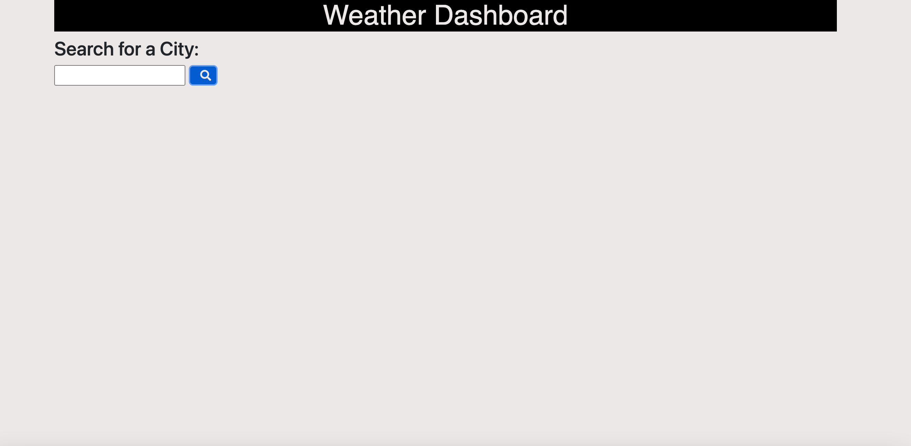
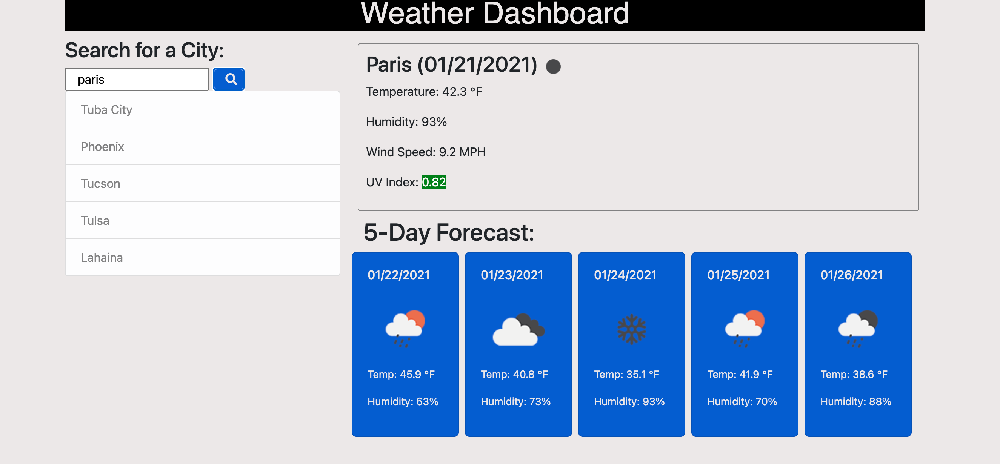

# Stephanie's weather-dashboard

## Description 

This web application gives a weather outlook for mulitple cities. The weather for a city can be entered in by the user. The weather dashboard should display the name of the city, a weather icon representation of weather conditions, the current temperature, the humidity, the windspeed and the UV index. When the UV index is viewed it should be color coded as good for favorable, orange for moderate and red for severe.

A five-day forecast is also presented below the current weather that includes the date, an icon representation of weather conditions, the temperature and humidity. The forecast days represent the weather between 11am and 1pm. In the case that the forecast data did not have 5 days of mid-day forecasts available starting the date after the current weather displayed, the last weather forecast on the 5th day is used (if current day is day 0). For example, this can occur when the user searches for weather at 12:01am on a particular date.

Also included in the weather dashboard is the ability to click on a city in search history and again be presented with the current and future conditions. 

Lastly, the weather dashboard utilizes local storage so that the search history remains when the page is refreshed.

This JavaScript code contains skills I recently learned including using moment.js to manipulate times and dates, using fetch to retrieve server-side APIs (OpenWeather API), using event listeners in new ways (for me) and learning more about event listeners. I also practiced using Bootstrap when setting up the page.

## Screenshots of web application 

## Link

[Link to Stephanie's Weather Dashboard applicaton](https://sgiel.github.io/weather-dashboard/)

